<picture>
  <source media="(prefers-color-scheme: dark)" srcset="dark_mode.svg">
  <source media="(prefers-color-scheme: light)" srcset="light_mode.svg">
  
</picture>

<picture>
  <source media="(prefers-color-scheme: dark)" srcset="snake-dark.svg">
  <source media="(prefers-color-scheme: light)" srcset="snake.svg">
  
</picture>

Launch photo: NASA/Joel Kowsky, <a href="https://commons.wikimedia.org/wiki/File:NASA%E2%80%99s_SpaceX_Crew-6_Launch_(NHQ202303020008).jpg">NASA’s SpaceX Crew-6 Launch</a>, public domain, cropped.
